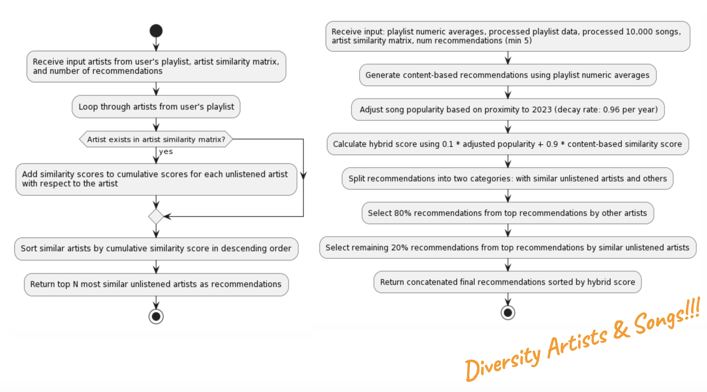

# music-recommender

## Demo

## Purpose
The purpose of this Personalized Music Recommendation Website is to combine content-based, popularity-based, and related artists' network analyses, alongside K-means clustering to offer personalized song recommendations from users' Spotify playlists.

## Data Sources

### Analyzing Top Songs (1960-2023)
- **Source:** ARIA and Billboard
- **Description:** This dataset comprises 10,000 top songs spanning from 1960 to 2023. It includes track information and audio features.
- **Dimensions:** 9,999 rows and 35 columns

### Music Playlist Data
- **Description:** This dataset is used for artist preference analysis. It contains user ID, artist, track name, and playlist name information.
- **Dimensions:** 12,891,680 rows and 4 columns

### Spotify API
- **Description:** Utilizing the Spotify API to gather additional information about artists, tracks, and user playlists. This includes audio features, related artists, and user preferences.
- **Access:** Through authorized API calls using OAuth authentication.

### Hybrid Playlist Recommendation Process

